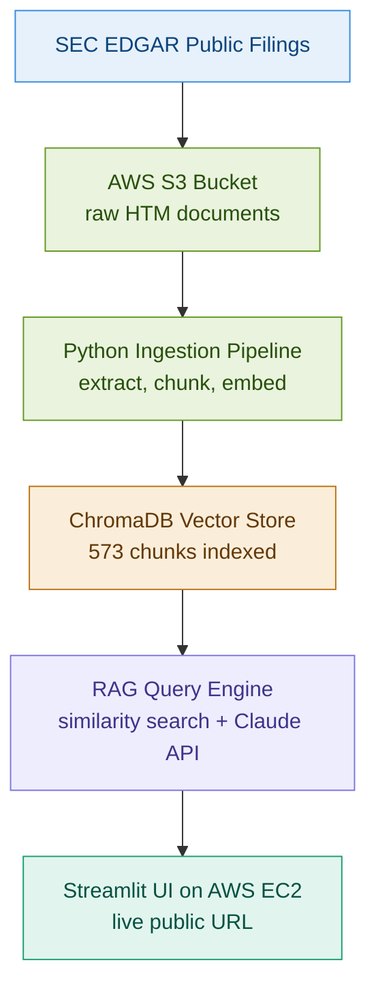

# FinDocRAG: Financial Document RAG Pipeline on AWS

## Live Demo
http://3.238.34.92:8501

## One-Line Summary
A production RAG pipeline on AWS EC2 that lets analysts ask natural language questions against SEC 10-K filings, with grounded answers from Claude API and source citations on every response.

## Business Problem
Financial analysts spend hours manually searching through earnings reports, 10-K filings, and compliance documents to answer specific questions. This system grounds LLM answers in actual source documents, making every answer traceable, verifiable, and hallucination-resistant.

## Target Stakeholder
Financial analyst, compliance officer, or risk manager who needs fast answers from large document libraries without reading every page.

## Tools Used
- Python
- AWS S3 (document storage)
- AWS EC2 (application hosting)
- ChromaDB (vector store)
- sentence-transformers (embeddings)
- Claude API Haiku (answer generation)
- Streamlit (UI)
- SEC EDGAR (public financial filings)
- GitHub (version control)

## Dataset
Source: SEC EDGAR public 10-K filings (no licensing restrictions)
- JPMorgan Chase 10-K 2025
- Goldman Sachs 10-K 2025
- Apple 10-K 2025

Total: 573 chunks indexed across 3 documents

## Architecture



## Pipeline Details

- Documents stored in AWS S3 as raw HTM files
- Python ingestion pipeline extracts text, chunks into 800-word segments with 100-word overlap
- Embeddings generated with sentence-transformers and indexed into ChromaDB
- At query time: question embedded, top-k chunks retrieved, sent to Claude Haiku with grounding prompt
- Every answer includes source document, file name, and relevance score
- Hallucination guard returns explicit not-found response when answer is outside retrieved chunks

## What Makes This RAG Production-Grade

1. Source citations on every answer showing document, file, and relevance score
2. Hallucination guard that returns "not found in documents" instead of making things up
3. AWS S3 as the document store with automated ingestion pipeline
4. Deployed on AWS EC2 with public URL
5. Real SEC filings, not toy data

## Key Questions the System Answers
1. What are JPMorgan's primary risk management principles?
2. What is Apple's revenue recognition policy?
3. What were Goldman Sachs net revenues in 2025?
4. How does JPMorgan describe its fortress balance sheet strategy?
5. What are the main business segments of Goldman Sachs?

## Sample Results
Goldman Sachs net revenues in 2025: $58,283 million total
- Global Banking and Markets: $41,453 million
- Asset and Wealth Management: $16,679 million
- Platform Solutions: $151 million

All answers grounded in source documents with relevance scores above 60%.

## How to Run Locally

```bash
git clone https://github.com/Tarun-B-12/financial-doc-rag-aws.git
cd financial-doc-rag-aws
python -m venv venv
source venv/bin/activate
pip install -r requirements.txt
cp .env.example .env
# Add your ANTHROPIC_API_KEY and AWS credentials to .env
python src/download_docs.py
python src/ingest.py
python src/vectorstore.py
streamlit run app/streamlit_app.py
```

## What This Project Demonstrates
- RAG pipeline architecture with source grounding and hallucination guard
- AWS S3 for cloud document storage and ingestion
- AWS EC2 deployment of a production Streamlit application
- Vector similarity search with ChromaDB and sentence-transformers
- Claude API integration for grounded answer generation
- Real financial document processing from SEC EDGAR
- End-to-end pipeline from raw documents to deployed application

## Limitations
- ChromaDB is stored locally on EC2. Production version would use a managed vector database.
- Single EC2 instance with no load balancing. Production would use auto-scaling.
- Documents are static. Production would have automated refresh when new filings are published.

## Next Improvements
- Add more SEC filings and companies
- Connect to live SEC EDGAR API for automatic document refresh
- Add evaluation metrics (retrieval precision, answer faithfulness)
- Move to a managed vector database like Pinecone or Weaviate
- Add authentication for enterprise use
