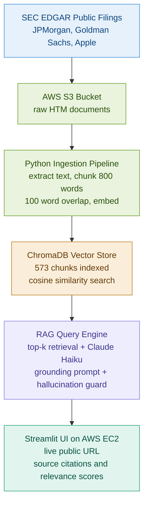

# FinDocRAG: Financial Document RAG Pipeline on AWS

> Ask questions about JPMorgan, Goldman Sachs, and Apple 10-K filings. Get grounded answers with source citations. No hallucinations.

## Live Demo

**http://3.238.34.92:8501**

## Problem

Financial analysts spend hours manually searching through 10-K filings, earnings reports, and compliance documents to answer specific questions. Generic LLMs hallucinate financial figures. There is no way to verify where an answer came from.

## Solution

A production RAG pipeline on AWS that retrieves the most relevant passages from real SEC filings, grounds every LLM answer in source text, cites the document and relevance score, and explicitly refuses to answer questions outside the documents.

## Architecture



## What Makes This RAG Production-Grade

| Feature | Description |
|---|---|
| Source citations | Every answer cites document, file, and relevance score |
| Hallucination guard | Returns "not found in documents" instead of fabricating |
| Real documents | Actual SEC 10-K filings, not toy PDFs |
| Cloud deployment | Live on AWS EC2 with public URL |
| Company filter | Search within specific company filings |

## Sample Results

**Q: What were Goldman Sachs net revenues in 2025?**

A: Goldman Sachs total net revenues in 2025 were $58,283 million.
- Global Banking and Markets: $41,453 million
- Asset and Wealth Management: $16,679 million
- Platform Solutions: $151 million

Source: goldman_10k.htm | Relevance: 70.1%

**Q: What is the weather in Dallas?**

A: The provided documents do not contain sufficient information to answer this question.

## Documents Indexed

| Company | Filing | Chunks |
|---|---|---|
| JPMorgan Chase | 10-K 2025 | 273 |
| Goldman Sachs | 10-K 2025 | 254 |
| Apple | 10-K 2025 | 46 |
| **Total** | | **573** |

## Tech Stack

| Tool | Purpose |
|---|---|
| Python | Ingestion and query pipeline |
| AWS S3 | Document storage |
| AWS EC2 | Application hosting |
| ChromaDB | Vector store |
| sentence-transformers | Document embeddings (all-MiniLM-L6-v2) |
| Claude API (Haiku) | Answer generation with grounding prompt |
| Streamlit | Frontend UI |
| SEC EDGAR | Public financial filings source |

## How to Run Locally

```bash
git clone https://github.com/Tarun-B-12/financial-doc-rag-aws.git
cd financial-doc-rag-aws
python -m venv venv
source venv/bin/activate
pip install -r requirements.txt
cp .env.example .env
# Add ANTHROPIC_API_KEY, AWS credentials to .env
python src/download_docs.py
python src/ingest.py
python src/vectorstore.py
streamlit run app/streamlit_app.py
```

## Performance

| Metric | Value |
|---|---|
| Query latency | 2 to 3 seconds end to end |
| Local retrieval time | Under 100ms |
| Chunks indexed | 573 across 3 companies |
| LLM API cost | Under $1 total for full project |

## Limitations

- ChromaDB stored locally on EC2. Production would use Pinecone or Weaviate.
- Single EC2 instance, no load balancing. Production would use auto-scaling.
- Documents are static. Production would auto-refresh when new filings are published.
- No evaluation metrics yet. Production would track retrieval precision and answer faithfulness.

## Future Improvements

- Add RAGAS evaluation framework for retrieval precision and answer faithfulness scoring
- Connect to live SEC EDGAR API for automatic document refresh
- Add more companies and filing types (earnings calls, 8-K filings)
- Move to a managed vector database
- Add authentication for enterprise use
- Implement conversation history for multi-turn Q&A

## What This Project Demonstrates

- RAG pipeline architecture with source grounding and hallucination detection
- AWS S3 and EC2 for cloud document storage and deployment
- Vector similarity search with ChromaDB and sentence-transformers
- Claude API integration with a strict grounding prompt
- Real financial document processing from SEC EDGAR
- Production deployment with a live public URL
